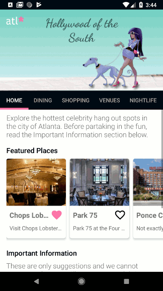
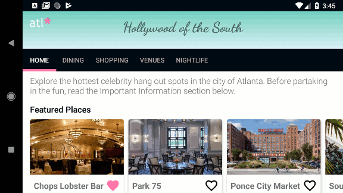

# ATLstar
Tour Guide App for Udacity Android Basics Nanodegree

  

My inspiration came from Google Maps.

Landscape:

Youtube:  https://youtu.be/CU-TtqaUtwA

---------

Images and attraction descriptions were found online and attributions are given for quotes within the app. 
Main sources included Google Maps, Atlanta.net, Thrillist.com, and Wikipedia. This project is for educational purposes.

Cartoon of woman walking dog was created by Ddraw - Freepik.com
